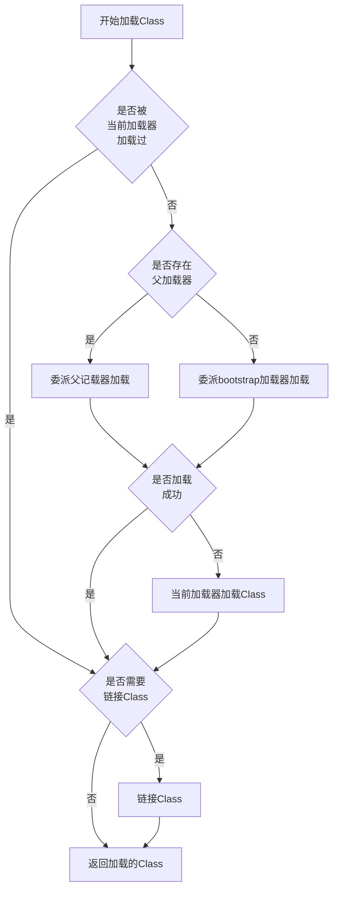

这是标题内容
这是标题内容

这是标题内容

这是标题内容

这是标题内容
## 标题一标题

```java
public static void start(android.content.Context context) {
    android.content.Intent starter = new Intent(context, A.class);
    starter.putExtra();
    context.startActivity(starter);
}
```


<pre>
public static void start(android.content.Context context) {
    android.content.Intent starter = new Intent(context, A.class);
    starter.putExtra();
    context.startActivity(starter);
}
</pre>

```unknown
this is text
```



这是标题一

这是标题一

这是标题一

这是标题一

这是标题一
### 标题1.1标

这是标题一.1

这是标题一.1
这是标题一.1

这是标题一.1

这是标题一.1

## 标题二

这是标题一.1

这是标题一.1
这是标题一.1

这是标题一.1

这是标题一.1

### 标题2.1

这是标题一.1

这是标题一.1
这是标题一.1

这是标题一.1

这是标题一.1

这是标题一.1

这是标题一.1
这是标题一.1

这是标题一.1

这是标题一.1
### 标题2.1.1标题一

这是标题一.1

这是标题一.1
这是标题一.1

这是标题一.1

这是标题一.1

这是标题一.1

这是标题一.1
这是标题一.1

这是标题一.1

这是标题一.1
### 标题2.2

这是标题一.1

这是标题一.1
这是标题一.1

这是标题一.1

这是标题一.1

这是标题一.1

这是标题一.1
这是标题一.1

这是标题一.1

这是标题一.1

## 标题三
### 标题3.1
这是标题一.1

这是标题一.1
这是标题一.1

这是标题一.1

这是标题一.1

这是标题一.1

这是标题一.1
这是标题一.1

这是标题一.1

这是标题一.1
### 标题3.2
#### 标题3.2.1

这是标题一.1

这是标题一.1
这是标题一.1

这是标题一.1

这是标题一.1

这是标题一.1

这是标题一.1
这是标题一.1

这是标题一.1

这是标题一.1

